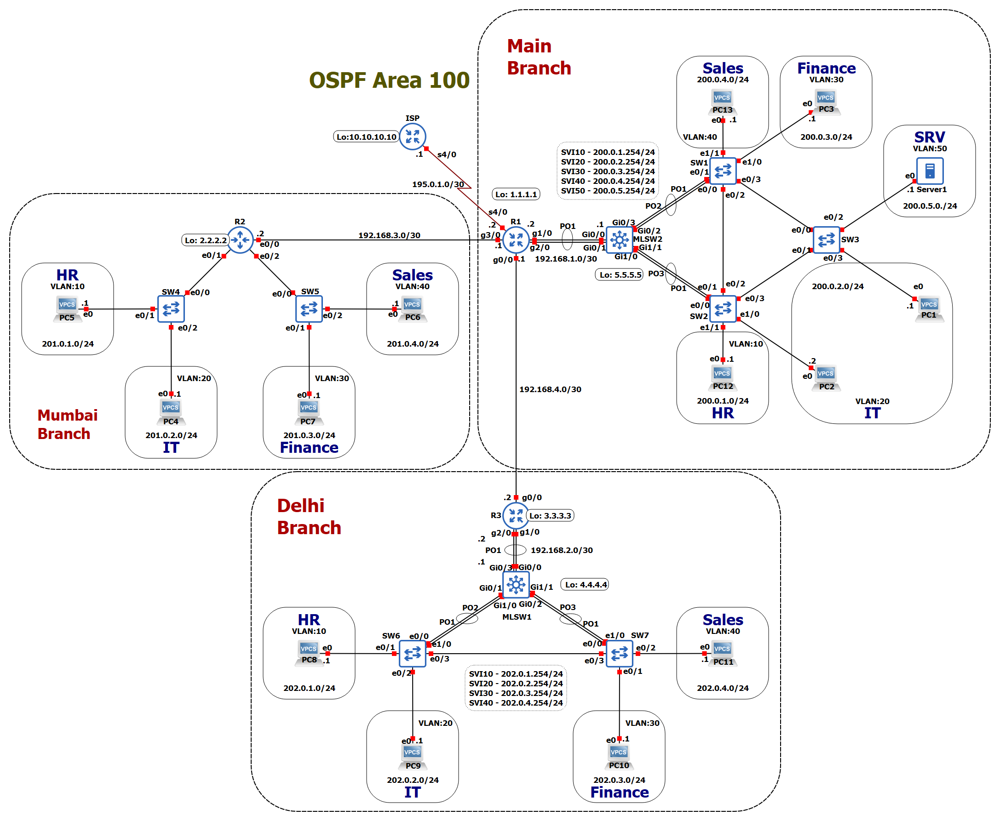

# Enterprise Network Simulation with GNS3  
A modular, enterprise-grade network topology simulating a multi-branch corporate environment with redundancy, VLAN segmentation, and dynamic routing.  

For the project file, please refer to this [**section**](#gns3-setup-guide).





## **Project Overview**  
### **Objective**  
Design a scalable, fault-tolerant enterprise network with three branches (Main, Mumbai, Delhi) using VLANs, OSPF, RSTP, and EtherChannel for redundancy.  

### **Scope**  
- **Main Branch:** Core network with ISP connectivity, multilayer switching, and server VLAN.  
- **Mumbai Branch:** Remote office with simplified Layer 2 switching.  
- **Delhi Branch:** Redundant remote office with multilayer switching.  

### **Key Features**  
- VLAN segmentation for department isolation (HR, IT, Finance, Sales, Servers).  
- Inter-VLAN routing via multilayer switches (SVIs).  
- OSPF for dynamic routing between branches.  
- RSTP and EtherChannel for loop prevention and link redundancy.   


## **Technologies Used**  
- **IPv4 Addressing:** Subnetted per VLAN.  
- **VLANs & SVIs:** Layer 3 switches handle inter-VLAN routing.  
- **RSTP:** Prevents switching loops in redundant links.  
- **OSPF:** Dynamic routing between branches.  
- **EtherChannel:** LACP for aggregated links.  


## **Configuration Highlights**  
### **VLAN Trunking (Main Branch Multilayer Switch)**  
```cisco  
interface Port-channel1  
  switchport trunk encapsulation dot1q  
  switchport mode trunk  
!  
interface range GigabitEthernet0/0-1  
  channel-group 1 mode active  
```

### **OSPF on Main Router**  
```cisco  
router ospf 1
 passive-interface Loopback1
 network 192.168.1.0 0.0.0.3 area 100
 network 192.168.3.0 0.0.0.3 area 100
 network 192.168.4.0 0.0.0.3 area 100
 default-information originate  
```  


## **Validation & Testing**  
### **Verify VLANs**  
```cisco  
show vlan brief  
```  

### **Trunk Information**
```cisco
show interfaces trunk
```

### **OSPF Information**
```cisco
show ip protocols
```

### **Check OSPF Neighbors**  
```cisco  
show ip ospf neighbor  
```  

### **Inspect EtherChannel**  
```cisco  
show etherchannel summary  
```  


## **GNS3 Setup Guide**  
1. **Import Project:**  
   - Clone or download the repository and import `.gns3project` file in GNS3 (VM setup required).  
   - *All configurations are pre-loaded.*  
2. **Device Images Used:**  
   - **Routers:** `x86_64_crb_linux-adventerprisek9-ms.iol` || `c7200-adventerprisek9-mz.153-3.XB12.image`
   - **Layer 3 Switch:** `vios_l2-adventerprisek9-m.ssa.high_iron_20200929.qcow2`
   - **Layer 2 Switch:** `x86_64_crb_linux_l2-adventerprisek9-ms.iol`

**Note:**
 [**Click Here**](https://1drv.ms/u/c/f405bc8fca1ded07/EYcuW5M1qsxImMRQvuv5p94B-c0tMxFGPEs4H8EJJMiIJQ?e=MCy15A)
 to download the `.gns3project` file, which includes the device images.


## Lessons Learned  

Below are the key challenges encountered during the GNS3 enterprise network simulation and how they were resolved.  

### **1. Router IOL Image Limitations with EtherChannel**  
#### **Challenge**  
The initial Cisco IOL (IOS on Linux) router images performed poorly with EtherChannel, causing instability and packet loss.  

#### **Root Cause**  
- IOL images do not properly support EtherChannel. When a virtual interface port channel is created, they fail to assign the BIA address to the port, causing EtherChannel to malfunction..  

#### **Solution**  
- Switched to **Cisco 7200 router image** (*c7200-adventerprisek9-mz.153-3.XB12.image*), which handle EtherChannel efficiently.
- Or manually assign the MAC address to the port channel interface.
 

### **2. EtherChannel Link Failure Between Router and Switch**  
#### **Challenge**  
The EtherChannel link between the C7200 router and multilayer switch failed to establish, blocking connectivity.  

#### **Root Cause**  
- The Cisco 7200 router does not support **LACP** or **PAgP** negotiation protocols.  

#### **Solution**  
- Configured **static EtherChannel** (on-mode) on the multilayer switch:  
  ```cisco  
  interface Port-channel1  
    no switchport  
    ip address A.B.C.D   
  !  
  interface range GigabitEthernet0/1-2  
    channel-group 1 mode on  # Force static EtherChannel
  ```


## **Future Enhancements**  
1. Implement IPv6 dual-stack.  
2. Add site-to-site VPNs between branches.  
3. Integrate security policies (ACLs, Port Security).  


## **Repository Structure**  
```
enterprise-network-gns3/  
├── configs/
├── topology.png
├── README.md
└── Enterprise-Network.gns3project
```  
 
